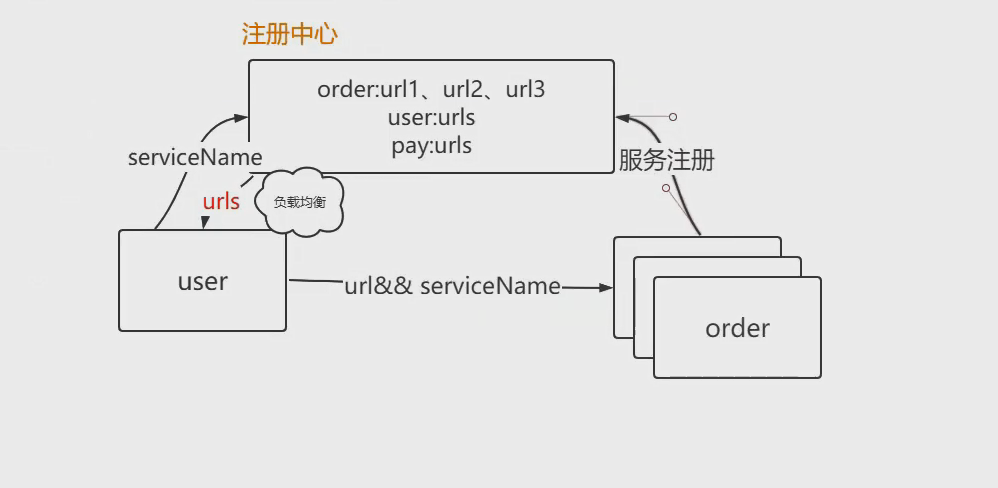

#SampleRPC框架的结构图



#RPC框架 一个自主搭建的RPC框架
____
## part1. 一个简单的RPC请求实现 V1.0
____
## 功能描述
仅仅实现了简单的服务提供者和服务消费者的远程通讯及调用
客户端请求调用服务端的一个方法，服务端返回执行的反方的结果
____
##特点
+ __*使用Netty作为通讯框架, I/O多路复用*__
+ __*Rpc客户端使用线程池并发处理消费者的RPC请求*__
+ __*客户端使用了动态代理，使请求更加灵活，不局限于某个固定的API*__
____
##局限
+ __*服务端仅仅只能服务固定的接口，不具有灵活性*__
+ __*无论是客户端还是服务端，其host和port都是固定的，不具有拓展性*__
+ __*有粘包拆包问题*__
____
## part2. RPC框架V2.0
____
## 功能描述
在之前的简单直连的RPC请求基础上，使用反射和动态代理使得框架可以处理不同接口的请求，不再仅限于特定接口，使用序列化反序列化提升效率与安全性，
使用自定义协议解决粘包、拆包等问题。从而基本构建出一个RPC框架模型
实现了RPC的基本能
____
##特点
+ __*使用Netty作为通讯框架, I/O多路复用*__
+ __*Rpc客户端使用线程池并发处理消费者的RPC请求*__
+ __*使用多种序列化反序列化器(Json, Hessian, protoBuf)，能够更方便的解析发送数据与返回数据（二进制到对象的转换）*__
+ __*对请求和响应分别封装一个通用对象，方便客户端和服务端的参数解析及API调用, 返回的参数也不再局限于某一种*__
+ __*客户端使用了动态代理，使请求更加灵活，不局限于某个固定的API*__
+ __*服务端使用反射机制，动态调用Rpc请求的方法，提高Rpc请求的灵活性，使其不在局限于特定的方法*__
+ __*自定义传输协议，解决粘包拆包等问题*__
____
## 自定义传输协议

调用参数与返回值的传输采用了如下协议

```
+---------------+-----------------+-------------+
|  Package Type | Serializer Type | Data Length |
|    4 bytes    |     4 bytes     |   4 bytes   |
+---------------+-----------------+-------------+
|           Data Bytes                          |
|        Length: ${Data Length}                |
+-----------------------------------------------+
```

| 字段            | 解释                                                         |
| :-------------- | :----------------------------------------------------------- |
| Message Type    | 传输对象类型，标明这是一个调用请求还是调用响应，方便对象解析                     |
| Serializer Type | 序列化器类型，标明这个包的数据的序列化方式，在反序列化时使用对应的序列化器                   |
| Data Length     | 数据字节的长度，解决粘包拆包问题                                               |
| Data Bytes      | 传输的对象 |
____
##局限
+ __*客户端服务端属于直连，无论是客户端还是服务端，其host和port都是固定的，不具有拓展性*__
+ __*负载均衡问题*__

## part3. RPC框架V3.0
____
## 功能描述
在1.0的基础上加入了Nacos注册中心，解决了RPC请求时客户端还是服务端其host和port都是固定的问题，只需要知道Nocas
所在的服务器位置即可，可以动态调用不同服务器上的服务。并且加入了简单的负载均衡策略。

##特点
+ __*加入Nacos注册中心*__
+ __*对注册中心返回的对象进行了封装，让程序可以适配不同的注册中心*__
+ __*加入了简单的负载均衡策略*__

##局限
+ __*Rpc请求的等待响应值属于阻塞形式，服务端返回对象前都是阻塞状态，需要改为异步形式*__
+ __*其他功能还不全面，比如熔断、限流、服务降级等*__
+ __*并发RPC请求不支持，客户端共享资源（类变量）太多，导致并发有很多问题*__
  

## part3. RPC框架V3.1
____
## 功能描述
在2.0的基础进行优化, 对客户端进行了改造，将发送数据从Handler中剥离出来，封装一个方法，对相同连接实现复用（通过复用Channel，Netty保证了Channel的线程安全性）
解决并发问题。

##特点
+ __*解决2.0版本 并发RPC请求问题*__
+ __*增加客户端异步回调机制接收服务端返回的对象*__
+ __*解决2.0，同一个客户端请求相同服务器的Service的时候，都会建立一个Socket连接的问题，资源浪费*__
+ __*服务端增加工作线程池，使得I/O线程池不会因为某一channel业务较长而阻塞，影响其他Channel的RPC请求处理*__

##局限
+ __*功能方面还有待优化，例如相同Socket高并发RPC请求的效率*__
+ __*其他功能还不全面，比如熔断、限流、服务降级等*__


